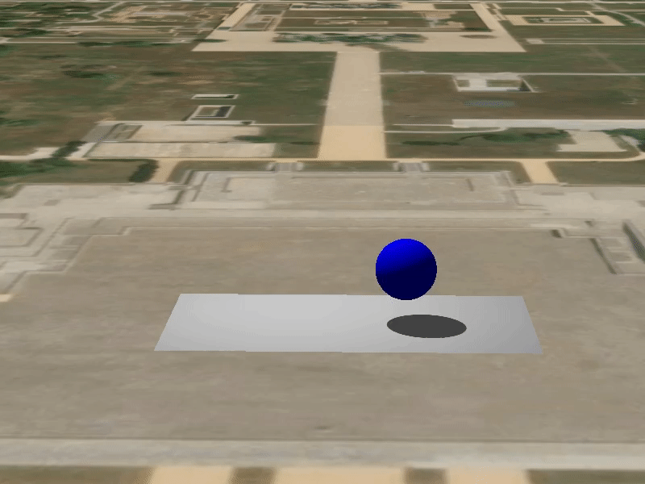
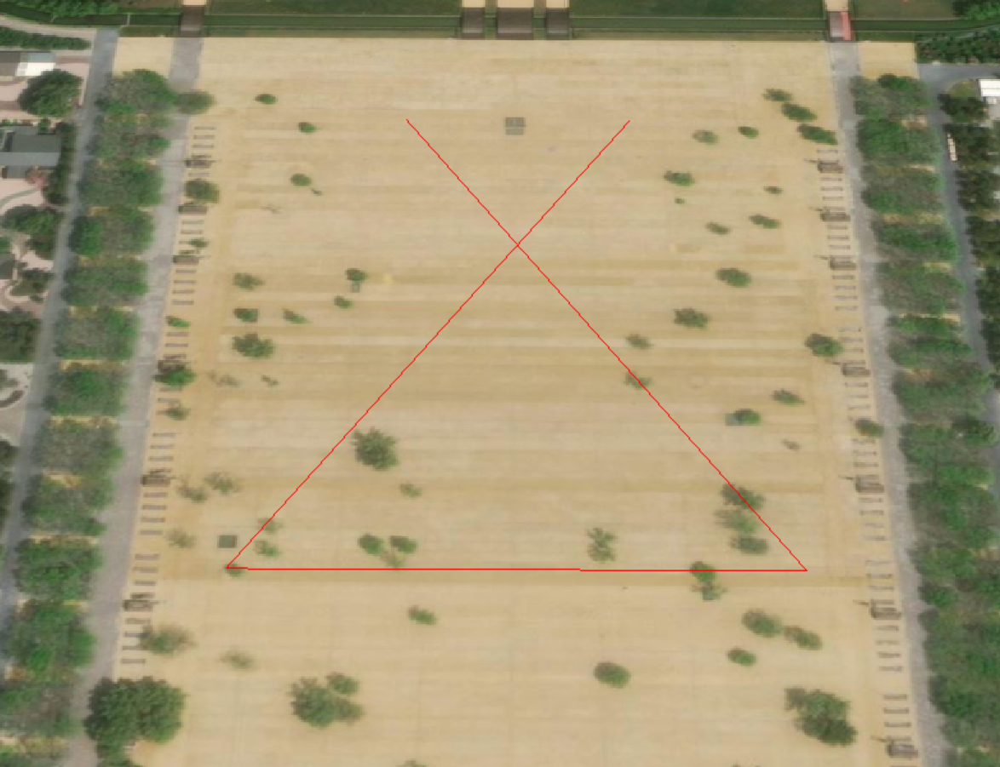

# three-to-cesium
- - -
**语言:** [English](README.md) / [简体中文](README.zh-CN.md)
- - -
一个使Cesium和Three.js同步运行的插件。
---

## 🎨在线示例
<https://weijun-lab.github.io/three-to-cesium/>
## 安装
* `npm install three-to-cesium`
* 或者下载本仓库
## 使用方式
### ESM(ECMAScript Modules)
```js
import ThreeToCesium from "three-to-cesium";
```
### UMD(Universal Module Definition)
```html
<script src="three-to-cesium/dist/three-to-cesium.umd.cjs"></script>
```
### 注意
本插件依赖于Cesium和Three.js库,使用UMD引入时,请确保Cesium和Three.js库已经引入。
```html
<script src="path/to/three.js"></script>
<script src="path/to/Cesium.js"></script>
<script src="three-to-cesium/dist/three-to-cesium.umd.cjs"></script>
```
若采用构建工具进行模块引入，请确保项目环境中已安装Cesium和Three.js。
```bash
npm install three cesium
```
```js
import ThreeToCesium from "three-to-cesium";
```
---
## 代码示例
### 示例1
```js
let cesiumViewer = new Cesium.Viewer('map', {
  sceneModePicker: false,
});
let sceneIntegrator = ThreeToCesium(cesiumViewer);
let position = Cesium.Cartesian3.fromDegrees(108.95943284886424, 34.288286155753546, 5);
let mesh = new THREE.Mesh(
  new THREE.BoxGeometry(10, 10, 10),
  new THREE.MeshNormalMaterial()
);
sceneIntegrator.add(mesh,position)
cesiumViewer.scene.postRender.addEventListener(() => {
  sceneIntegrator.update();
});
```


### 示例2
```js
let cesiumViewer = new Cesium.Viewer('map', {
    sceneModePicker: false,
});
let localPositions = ThreeToCesium.localizePositions([
  Cesium.Cartesian3.fromDegrees(108.95993690885348, 34.28688948263291, 0),
  Cesium.Cartesian3.fromDegrees(108.95836123161854, 34.28461622000204, 0),
  Cesium.Cartesian3.fromDegrees(108.96052860333033, 34.28463093923793, 0),
  Cesium.Cartesian3.fromDegrees(108.95894270765785, 34.286895032131916, 0),
]);
let sceneIntegrator = ThreeToCesium(cesiumViewer);
let geometry = new THREE.BufferGeometry().setFromPoints(localPositions.positions);
let material = new THREE.LineBasicMaterial({
  color: 0xff0000,
});
let line = new THREE.Line(geometry, material);
sceneIntegrator.add(line, localPositions.centerInWorld);
cesiumViewer.scene.postRender.addEventListener(() => {
  sceneIntegrator.update();
});
```

### 示例3
```js
let cesiumViewer = new Cesium.Viewer('map', {
    sceneModePicker: false,
});
let sceneIntegrator = ThreeToCesium(cesiumViewer);
let position = Cesium.Cartesian3.fromDegrees(108.95943284886424, 34.288286155753546, 0.1);
let group = new THREE.Group();
sceneIntegrator.add(group, position);

let spotLight = new THREE.SpotLight(0xffffff, 7000);
spotLight.position.set(-10, 60, -10);
spotLight.shadow.mapSize = new THREE.Vector2(1024, 1024);
spotLight.shadow.camera.far = 130;
spotLight.shadow.camera.near = 40;
spotLight.shadow.mapSize = new THREE.Vector2(3000, 3000)
group.add(spotLight);
let ambientLight = new THREE.AmbientLight(0xffffff, 0.2);
group.add(ambientLight);

let planeGeometry = new THREE.PlaneGeometry(60, 30);
let planeMaterial = new THREE.MeshLambertMaterial({
    color: "#eee"
});
let plane = new THREE.Mesh(planeGeometry, planeMaterial);
plane.rotation.x = -0.5 * Math.PI;
plane.position.y = 0;
plane.position.z = 0;
group.add(plane);

let sphereGeometry = new THREE.SphereGeometry(5, 50, 50);
let sphereMaterial = new THREE.MeshLambertMaterial({
    color: "blue",
});
let sphere = new THREE.Mesh(sphereGeometry, sphereMaterial);
group.add(sphere);

sceneIntegrator.threeRenderer.shadowMap.enabled = true;
spotLight.castShadow = true;
plane.receiveShadow = true;
sphere.castShadow = true;

let step = 0;
let clock = new THREE.Clock();
cesiumViewer.scene.postRender.addEventListener(() => {
    let delta = clock.getDelta();
    step += delta * 3;
    sphere.position.x = 10 * Math.cos(step);
    sphere.position.y = 5 + 10 * Math.abs(Math.sin(step));
    sceneIntegrator.update();
});
```

## 参数
```js
ThreeToCesium(cesiumViewer,option);
```
| 参数名 | 类型 | 描述 |
| --- | --- | --- |
| **cesiumViewer** | Cesium.Viewer | - |
| **options** | Object | - |
### Options
| 配置项 | 类型 | 默认值 | 描述 |
| --- | --- | --- | --- |
| **cameraFar** | Number | 10000 |  摄像机视锥体远端面。 |
| **cameraNear** | Number | 0.1 |  摄像机视锥体近端面。 |

## 方法
| 方法名 | 返回值 | 描述 |
| --- | --- | --- |
| add(`<THREE.Object3D>` object, `<Cesium.Cartesian3>` position) | THREE.Group | 添加一个Three.js的3d对象到地球的指定位置。 |
| remove(`<THREE.Object3D>` object) | - | 移除指定的Three.js3d对象。 |
| update() | - | 同步Three.js和Cesium的相机并调用THREE.WebGLRenderer.render()方法 |
| destroy() | - | 销毁Three.js的场景并移除对应的dom节点。 |
| **static** localizePositions(`Array.<Cesium.Cartesian3>` array) | {positions,centerInWorld} | 将传入的全局Cartesian3坐标转为以其中心点为原点的局部坐标，返回值`positions`属性为局部坐标数组，`centerInWorld`属性为局部坐标系原点。用法见[示例2](#示例2) |
## 属性
| 属性名 | 类型 | 描述 |
| --- | --- | --- |
|**cesiumViewer**| Cesium.Viewer | - |
|**threeCamera**| THREE.PerspectiveCamera | - |
|**threeRenderer**| THREE.WebGLRenderer | - |
|**threeScene**| THREE.Scene | - |